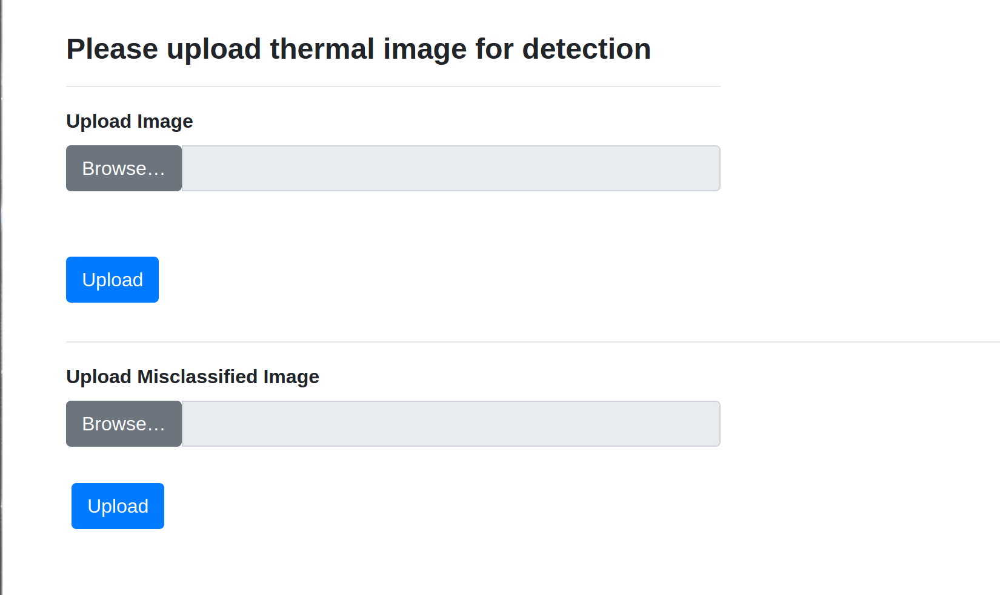
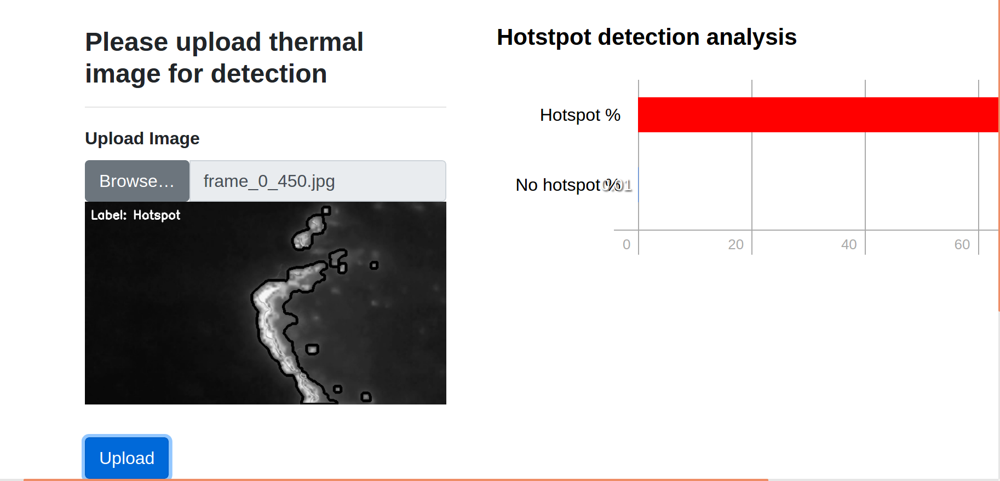
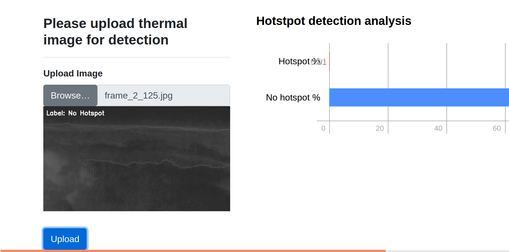

# Automated-detection-of-hotspot-in-thermal-images
A  CNN network trained for detecting hotspot in thermal imagery via transfer learning.
The binary detection method determines whether an image contains hotspots or not. 
A pre trained VGG16 keras model is used to extract arbitary feature vectors that globally describe the image. Based on the extracted features, a Logistic Regression classifier is trained on the features for image classification purposes. For images that contain hotspot, the hotspot regions are localised using Otsus's adaptive thresholding techniques.


### Fix opencv dependency issue when installing with pip on debian system
``` bash
apt-get install -y libsm6 libxext6 libxrender-dev
```
### Fix - add dependencies for opengl dependency
``` bash
sudo apt-get install -y libgirepository1.0-dev build-essential \
  libbz2-dev libreadline-dev libssl-dev zlib1g-dev libsqlite3-dev wget \
  curl llvm libncurses5-dev libncursesw5-dev xz-utils tk-dev libcairo2-dev
```

Software has been developed in Python. Install dependencies using
``` bash
pip install -r requirements.txt
```


## Instructions on using the VGG16 model for extracting features from training and testing data.

```bash
python feature_extraction.py [-h] -i IMAGES -o OUTPUT
optional arguments:
-h --help show this help message and exit
-i IMAGES, --images IMAGES path to input images
-o OUTPUT, --output OUTPATH path to output hdf5 file
```
### Example - Extracting features from training images
  ```python feature_extraction.py -i ../training_test_data/training/ -o features_training.hdf5```
  
### Example - Extracting features from testing images
   ```python feature_extraction.py -i ../training_test_data/testing/ -o features_testing.hdf5 ```

Once the features have been extracted, a Logistric Regression model can be trained on the extracted features

```bash
python classifier.py [-h] -train TRAIN_HDF5 -test TEST_HDF5
optional arguments:
-h --help show this help message and exit
-train TRAIN_HDF5, --train_hdf5 TRAIN_HDF5 path to trained hdf5 file
-test TEST_HDF5, --test TEST_HDF5 path to test hdf5 file
```
### Example - Training a classifier on the extracted features
  ```python classifier.py -train features_training.hdf5 -test features.hdf5``` <br/>
  
  Output from the python script would be a `model.cpickle` file
  
  
 ## Running the flask app  to perform hot spot detection.
 
 Run the following commands to create your apps database tables and perform initial migration
 ```bash
flask db init
flask db migrate
flask db upgrade
```
To run the web application use:
```bash
python app.py
```
A web server would be spawend and one can type in the browser `localhost:5000` and you should see:
# 

## Input image-  thermal image with hotspots in image
# 

## Input image - thermal image with no hotspots in image
# 


